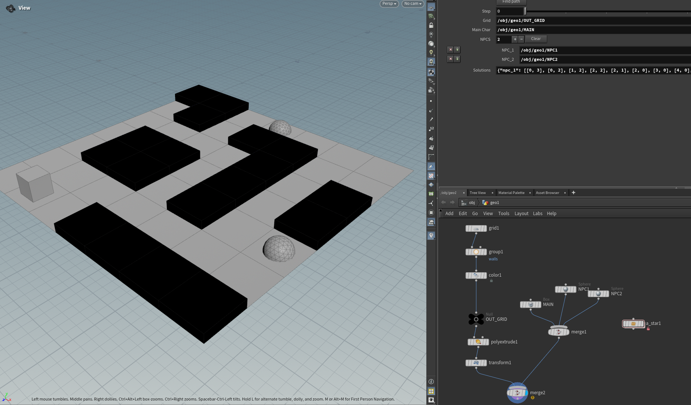

# Week 2 – A* Algorithm Assignment

This branch focuses exclusively on the **A\*** Houdini Digital Asset (HDA), expanded with new functionality as part of the Week 2 assignment.

## Assignment Overview
The goal of this week was to extend the A\* tool and introduce more advanced behavior inside Houdini. The updates include:

### ✔ Multiple Starting Points
The algorithm now supports **several starting positions** instead of just one.  
In the context of the HDA, each starting point represents an **NPC**, all navigating independently toward the same target (Main).

### ✔ Step-by-Step Visualization
A new **step slider** was added to visualize the progress of the pathfinding process.  
This allows you to:
- Observe the A\* search expanding through the grid  
- See each NPC follow its calculated shortest path  
- Scrub through the algorithm frame-by-frame for debugging or teaching purposes  

